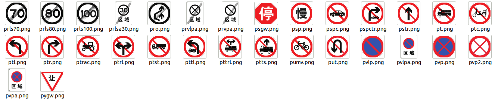

# CNTSDB
## CNTSDB：基于新国标的中国交通标志检测数据集

## 一、重新规划交通标志mark 文件
（1） 60项  指示标志

（2）141项  禁止标志

（3）80项  警告标志

（4）完整类别

## 二、利用TSGAN扩增交通标志
对于无实例和少实例的交通标志，使用TSGAN进行定向扩增

## 三、利用YOLO V8 检测交通标志可插入位置

## 四、合适位置插入新的交通标志

## 五、新增交通标志例子

#### wels

#### wls40

#### 雾天

## 六、数据集标注信息
数据集采用yolo格式标注

### 下载地址
链接: 
https://pan.baidu.com/s/1oeeO38RiWldEpAJ3RcImyw?pwd=9qpy
提取码: 9qpy

